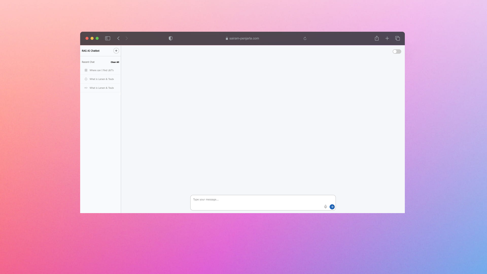
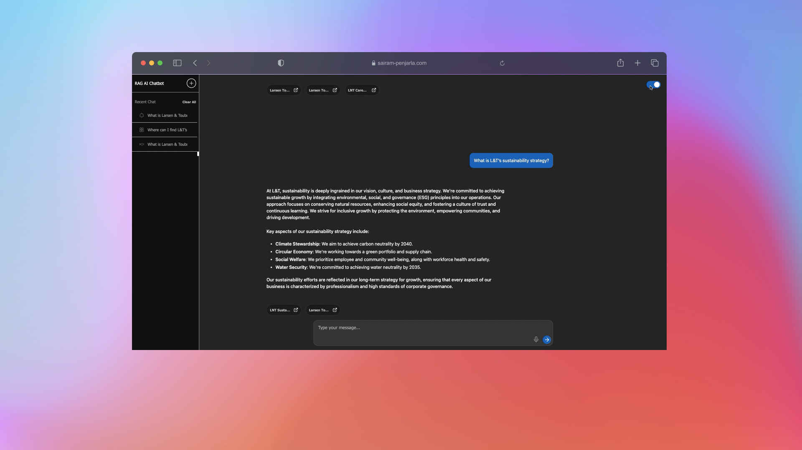
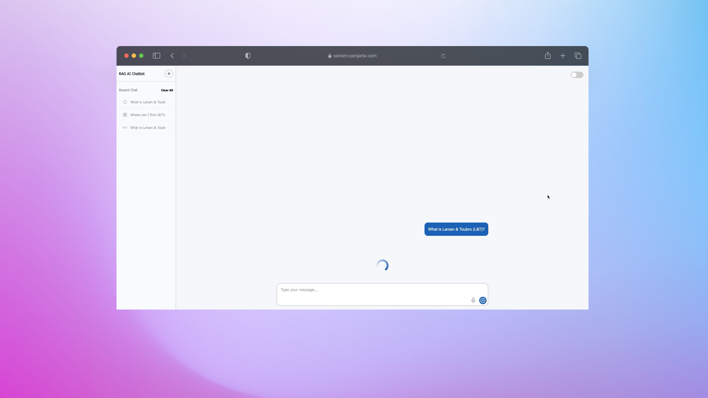
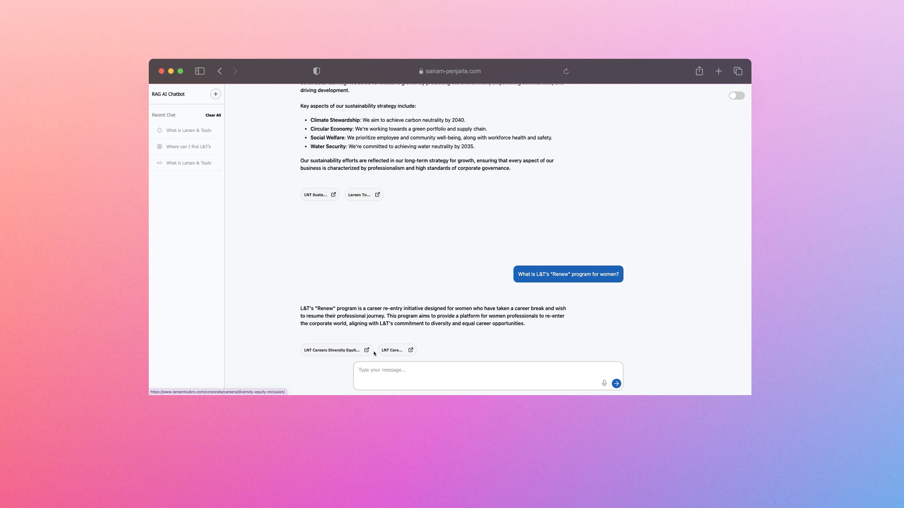
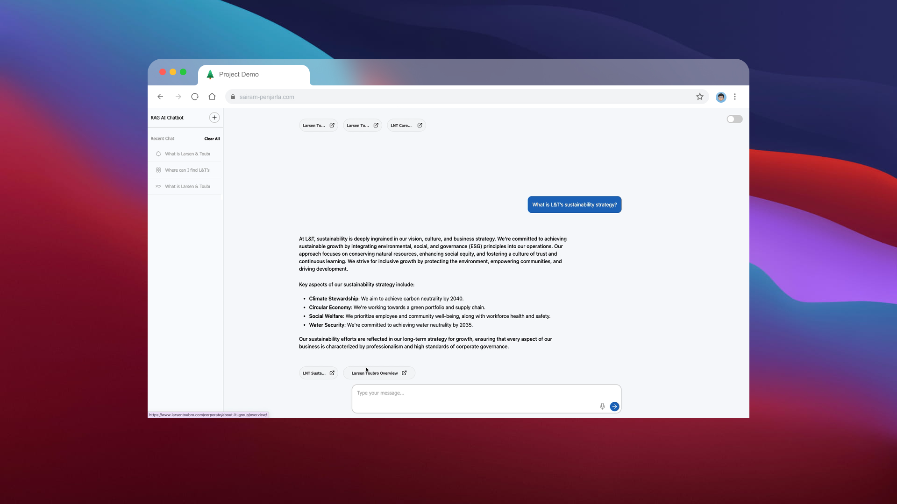
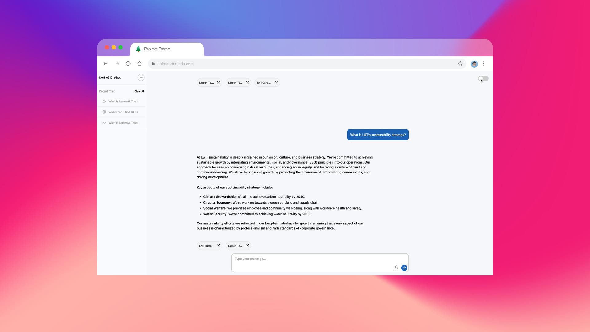

# [](https://psairam9301.wixsite.com/website) [](https://www.youtube.com/@sairampenjarla) [](https://github.com/sairam-penjarla) [](https://www.linkedin.com/in/sairam-penjarla-b5041b121/) [](https://www.instagram.com/sairam.ipynb/)

# NLP to SQL AI Agent

## Project Overview

The **NLP to SQL AI Agent** is an advanced AI-powered chatbot that enables users to directly interact with a database by asking questions in natural language. It utilizes OpenAI's language model to convert questions into SQL queries, execute them, and return the answers to the users. The chatbot also offers a smooth user interface with features like session management, light/dark mode toggle, and interactive loading animations.

## Project Setup

### 1. Clone the repository
Start by cloning the repository to your local machine:
```bash
git clone https://github.com/sairam-penjarla/nlp-to-sql-ai-agent.git
```

### 2. Change directory
Navigate to the cloned repository:
```bash
cd nlp-to-sql-ai-agent
```

### 3. Set up the environment
Create a virtual environment or Anaconda environment. For guidance, refer to this [blog post](https://sairampenjarla.notion.site/Environment-171d56a2fc2780dd9efcd4cef331fa2c).

#### Virtual Environment
```bash
python -m venv venv
source venv/bin/activate  # On Windows: venv\Scripts\activate
```

#### Anaconda Environment
```bash
conda create --name nlp_sql_agent python=3.8
conda activate nlp_sql_agent
```

### 4. Install dependencies
Install the required dependencies using the `requirements.txt` file:
```bash
pip install -r requirements.txt
```

### 5. Run the project
Run the Flask app:
```bash
python app.py
```
Visit `http://127.0.0.1:5000` in your browser to interact with the AI agent.

## Project Details

This project is an AI-powered chatbot built to help users interact with databases via natural language. Here are the key features of the project:

- **Natural Language Processing (NLP)**: The chatbot converts user questions into SQL queries.
- **Interactive Sessions**: Users can have multiple sessions, and each session is stored for future reference.
- **Light/Dark Mode**: Toggle between light and dark modes for a personalized experience.
- **Loading Animations**: View a small loading animation as the chatbot formulates responses.
- **Session Management**: View previous sessions in the sidebar, delete individual sessions, or clear all sessions.
- **OpenAI Integration**: Uses OpenAI to process user input and generate SQL queries.
- **Streamed Responses**: Responses are displayed word-by-word as the chatbot types, giving a real-time feel.
- **Icons for Sessions**: Each session has a unique icon from [Lucide.dev](http://lucide.dev).
- **Customizable**: Set up your OpenAI API key by creating a `.env` file and setting `OPENAI_API_KEY`.

This project is useful for anyone looking to integrate NLP with databases for query generation, and it serves as a robust example of building AI agents with Flask and OpenAI.

## Blog Post

For a more detailed explanation of this project and its real-world applications, check out this [blog post](https://sairampenjarla.notion.site/NLP-to-SQL-AI-AGENT-187d56a2fc2781aab916fc63638a71ba).

## Project Architecture

The architecture diagram and detailed flow of the application can be found in the `media` folder, along with the `screenshot` images illustrating the UI and interactions.

### Architecture Diagram


In this architecture, the process starts when the user asks a question. The chatbot first identifies relevant tables and columns from the database schema, then constructs an SQL query. The query results are used to generate the answer, which is streamed word-by-word to the user.

## Screenshots

Here are some screenshots showcasing the user interface and chatbot functionality:



  
  Showing the loading circle animation while the chatbot processes the question.
  


  
  The UI in dark mode.



  
  The UI in light mode.



  
  Chatbot responses, including tabular outputs.



  
  Sidebar displaying previous sessions.



  
  Chatbot responses in light mode.


  
  Chatbot responses in dark mode.


  
  Another example of chatbot responses in dark mode.

## License

This project is licensed under the MIT License. See the LICENSE file for more details.